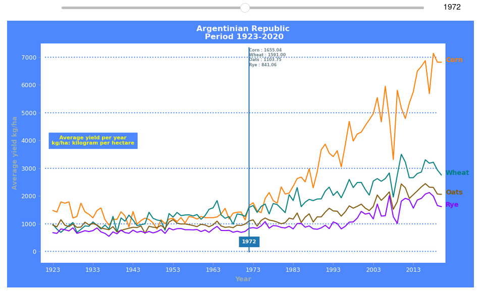
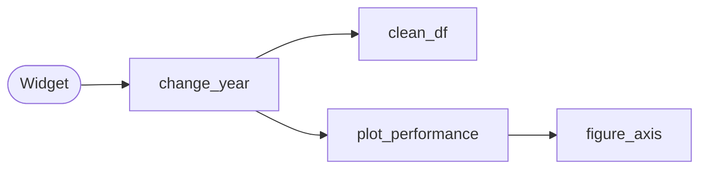

# Average yield of corn, wheat, oats, and rye in Argentina (kg/ha)

*Domain* Agroindustry\
*Period 1923-2020*

**Research Question**\
What was the average yield in kilograms per hectare (kg/ha) for corn, wheat, oats and rye in Argentina between 1923 and 2020? Has productivity increased over the last 30 years?

**Datasets**\
 \- [Corn](https://github.com/lfgajdem/Corn-Wheat-Oats-Rye/blob/main/assets/maiz-serie-1923-2019.csv
) - [Wheat](https://github.com/lfgajdem/Corn-Wheat-Oats-Rye/blob/main/assets/trigo-serie-1923-2020-anual.csv
) - [Oats](https://github.com/lfgajdem/Corn-Wheat-Oats-Rye/blob/main/assets/avena-serie-1923-2020.csv
) - [Rye](https://github.com/lfgajdem/Corn-Wheat-Oats-Rye/blob/main/assets/centeno-serie-1923-2020.csv
)

**Screenshot**
<figure>
   
</figure>

**Discussion**\
From 1946 to 1965, wheat yields were higher than corn yields.\
From 1923 to 1937, corn yields declined and then stabilized. A slow increase in corn yields began in 1957 and continued until 1975, when there was a very pronounced increase that set corn yields apart from those of other crops.\
Oats had similar yields until 1981, when a sustained increase began.\
Rye had similar yields until 1998, when a sustained increase began.\
All crops suffered a sharp decline (greatest in corn) between 2007 and 2009 due to a drought.

---
### Alberto Cairo's principles. Design choices.
- `'Truthfulness'` A specific function was performed to clean the data frames. The average yield per year was calculated for each crop after discarding the NANs. The graph starts in 1923 and shows an average yield of 0 (with a scale of every 1,000 kg/ha).
- `'Beauty'` The colors of the Argentine flag were used for the title, the background of the figure, the vertical bar, and the text on the bar. Soft colored ticks were added, and all frame borders were removed.
- `'Functionality'` A line plot was chosen to graph a 97-year timeline and compare yields. Horizontal lines were added at 1,000 kg/ha, followed by lines every 2,000 kg/ha, to determine each crop's range and observe variations in yield.
- `'Insightfulness'` A movable vertical bar was added to determine the average annual yield of the four crops.
Each crop was assigned a different color, and a name was added to the end of its corresponding plot. 
---
**Repository contents**
- [`'Argentina Corn-Wheat-Oats-Rye.ipynb'`](https://github.com/lfgajdem/Corn-Wheat-Oats-Rye/blob/main/Argentina%20Corn-Wheat-Oats-Rye.ipynb) File with code in the Jupiter notebook.
- [`'./assets'`](https://github.com/lfgajdem/Corn-Wheat-Oats-Rye/tree/main/assets) The directory contains data sets.
- [`'./images'`](https://github.com/lfgajdem/Corn-Wheat-Oats-Rye/tree/main/images) The directory contains screenshots.
- `'README.md'` This documentation file.
- `'requirements.txt'` Package versions.

**A brief explanation of the functions used**
- *clean_df* : Responsible for data analysis and cleaning tasks.
- *figure_axis* : It is responsible for plotting the figure, creating the title, legend, axis labels, and horizontal lines.
- *plot_performance* : It creates four line plots, one for each crop.
- *change_year* :  According to the selected year, it displays the average yield in kilograms per hectare (kg/ha) for each crop.

**Software versions**\
\- Python 3.13.7 [GCC 11.2.0] - IPython 8.30.0 - pandas 2.3.3 - numpy 2.1.3 - matplotlib 3.10.6 - ipywidgets 8.1.5

